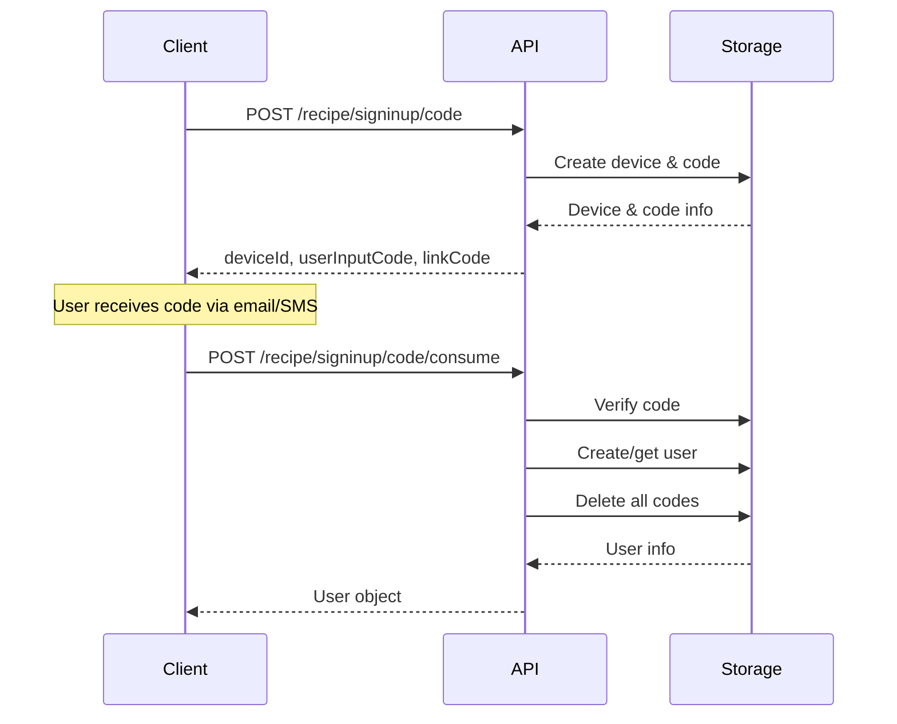

## Overview

Passwordless authentication allows users to sign in without a traditional password. Instead, users receive one-time codes (OTP) via email or SMS. SuperTokens Core implements a secure device-based flow with support for both link codes and user input codes.

## Core Concepts

### Devices

A device represents an authentication attempt. Each device:
- Is associated with an email or phone number
- Can have multiple codes (for retry scenarios)
- Tracks failed authentication attempts
- Has a unique device ID and device ID hash

### Codes

Two types of codes are supported:

1. **User Input Code**: 6-digit numeric code (e.g., "123456")
2. **Link Code**: Long alphanumeric code embedded in magic links

Both codes are cryptographically linked through a common salt.

## Create Code

Generate a one-time code for authentication.

### Implementation

**Implementation**: `io.supertokens.passwordless.Passwordless.createCode()` - [View source](https://github.com/supertokens/supertokens-core/blob/master/src/main/java/io/supertokens/passwordless/Passwordless.java#L85)

**Process:**
1. Generate or use existing device ID
2. Generate 6-digit user input code (if not provided)
3. Generate link code using HMAC-SHA256
4. Create device (if new) or add code to existing device
5. Return all code information

### API Endpoint

**POST** `/recipe/signinup/code`

**Request Body (New Device):**
```json
{
  "email": "user@example.com"
}
```

**Request Body (Existing Device):**
```json
{
  "deviceId": "existing-device-id",
  "userInputCode": "123456"  // Optional
}
```

**Response:**
```json
{
  "status": "OK",
  "preAuthSessionId": "device-id-hash",
  "codeId": "code-id",
  "deviceId": "device-id",
  "userInputCode": "123456",
  "linkCode": "base64-encoded-link-code",
  "timeCreated": 1234567890
}
```

### Code Generation Details

**User Input Code:**
- 6 random digits (0-9)
- Generated using `SecureRandom`
- Easy for users to type

**Link Code:**
```java
// Pseudo-code for link code generation
deviceId = random 32 bytes
linkCodeSalt = random 32 bytes
linkCode = HMAC-SHA256(deviceId + userInputCode, linkCodeSalt)
linkCodeHash = SHA-256(linkCode)
```

## Consume Code

Verify and consume a one-time code to authenticate.

### Implementation

**Implementation**: `io.supertokens.passwordless.Passwordless.consumeCode()` - [View source](https://github.com/supertokens/supertokens-core/blob/master/src/main/java/io/supertokens/passwordless/Passwordless.java#L413)

**Verification Process:**
1. Look up code by link code hash or user input code
2. Verify code hasn't expired
3. Check failed attempt limits
4. Verify device ID hash matches
5. Create or retrieve user
6. Delete all codes for the email/phone
7. Return user information

### API Endpoint

**POST** `/recipe/signinup/code/consume`

**Request Body (Using Link Code):**
```json
{
  "preAuthSessionId": "device-id-hash",
  "linkCode": "base64-encoded-link-code"
}
```

**Request Body (Using User Input Code):**
```json
{
  "deviceId": "device-id",
  "preAuthSessionId": "device-id-hash",
  "userInputCode": "123456"
}
```

**Response:**
```json
{
  "status": "OK",
  "createdNewUser": true,
  "user": {
    "id": "user-id",
    "email": "user@example.com",
    "phoneNumber": null,
    "timeJoined": 1234567890
  }
}
```

**Error Responses:**

```json
{
  "status": "RESTART_FLOW_ERROR"
}
```

```json
{
  "status": "INCORRECT_USER_INPUT_CODE_ERROR",
  "failedCodeInputAttemptCount": 2,
  "maximumCodeInputAttempts": 5
}
```

```json
{
  "status": "EXPIRED_USER_INPUT_CODE_ERROR",
  "failedCodeInputAttemptCount": 3,
  "maximumCodeInputAttempts": 5
}
```

## Device Management

### Get Device Codes

Retrieve all active codes for a device.

**Implementation**: `io.supertokens.passwordless.Passwordless.getDeviceWithCodesById()` - [View source](https://github.com/supertokens/supertokens-core/blob/master/src/main/java/io/supertokens/passwordless/Passwordless.java#L153)

**API Endpoint:**

**GET** `/recipe/signinup/codes?deviceId={deviceId}`

**Response:**
```json
{
  "status": "OK",
  "devices": [
    {
      "deviceIdHash": "hash",
      "email": "user@example.com",
      "phoneNumber": null,
      "codes": [
        {
          "codeId": "code-id-1",
          "timeCreated": 1234567890
        },
        {
          "codeId": "code-id-2",
          "timeCreated": 1234567891
        }
      ]
    }
  ]
}
```

### Delete Codes

Remove codes by email, phone number, or individual code ID.

**By Email:**

**POST** `/recipe/signinup/codes/remove`
```json
{
  "email": "user@example.com"
}
```

**By Phone:**
```json
{
  "phoneNumber": "+1234567890"
}
```

**By Code ID:**
```json
{
  "codeId": "code-id"
}
```

## User Operations

### Update User

Update user's email or phone number.

**Implementation**: `io.supertokens.passwordless.Passwordless.updateUser()` - [View source](https://github.com/supertokens/supertokens-core/blob/master/src/main/java/io/supertokens/passwordless/Passwordless.java#L748)

**Process:**
1. Validate at least one contact method remains
2. Check for duplicate email/phone
3. Update user record
4. Clean up old devices

**API Endpoint:**

**PUT** `/recipe/user`

**Request Body:**
```json
{
  "userId": "user-id",
  "email": "newemail@example.com",
  "phoneNumber": "+1234567890"
}
```

### Get User

Retrieve user by ID, email, or phone number.

**By Email:**

**GET** `/recipe/user?email={email}`

**By Phone:**

**GET** `/recipe/user?phoneNumber={phoneNumber}`

**By ID:**

**GET** `/recipe/user?userId={userId}`

## Security Features

### Code Expiration

Codes automatically expire after a configurable lifetime (default: 15 minutes).

**Configuration:**
```yaml
passwordless_code_lifetime: 900000  # 15 minutes in milliseconds
```

### Rate Limiting

Failed attempts are tracked per device:

- Maximum attempts: Configurable (default: 5)
- After max attempts: Device is deleted
- Cooldown period: N/A (device deletion enforces rate limit)

**Configuration:**
```yaml
passwordless_max_code_input_attempts: 5
```

### Device ID Hashing

Device IDs are hashed before storage:

```java
deviceIdHash = Base64.encode(SHA-256(deviceId))
```

This prevents:
- Device ID enumeration
- Timing attacks
- Direct device access without knowing the full device ID

### Link Code Security

- **HMAC-SHA256**: Link codes use cryptographic hashing
- **Unique salt per device**: Each device has a unique salt
- **Hash storage**: Only link code hashes are stored
- **One-time use**: Codes are deleted after consumption

## Code Lifecycle



## Configuration

### Core Settings

```yaml
# Code lifetime (15 minutes)
passwordless_code_lifetime: 900000

# Maximum failed attempts before device deletion
passwordless_max_code_input_attempts: 5
```

### Email/SMS Integration

SuperTokens Core does NOT send emails or SMS directly. You must:

1. Implement email/SMS sending in your application
2. Call the create code API
3. Send the code to the user via your preferred service
4. User submits code back to consume code API

## Error Handling

### Common Exceptions

- `RestartFlowException`: Device/code not found, user must start over
- `ExpiredUserInputCodeException`: Code has expired
- `IncorrectUserInputCodeException`: Invalid code entered
- `DeviceIdHashMismatchException`: Device ID doesn't match
- `DuplicateEmailException`: Email already in use
- `DuplicatePhoneNumberException`: Phone number already in use
- `UserWithoutContactInfoException`: Update would remove all contact methods

## Best Practices

1. **Short expiry times**: Keep code lifetime under 15 minutes
2. **Limit retries**: Set reasonable max attempt limits (5-10)
3. **Secure delivery**: Use reputable email/SMS providers
4. **Rate limiting**: Implement rate limiting on code creation
5. **User feedback**: Show remaining attempts on failed codes
6. **Cleanup**: Old codes are automatically cleaned by cron jobs
7. **Phone validation**: Validate phone numbers in E.164 format
8. **Email verification**: Email is auto-verified on successful code consumption

## Advanced Features

### Bulk Import

Import passwordless users in bulk:

**Implementation**: `io.supertokens.passwordless.Passwordless.createPasswordlessUsers()` - [View source](https://github.com/supertokens/supertokens-core/blob/master/src/main/java/io/supertokens/passwordless/Passwordless.java#L554)

### Multi-Tenancy

- Users are isolated per tenant
- Each tenant has independent code expiry settings
- Email/phone uniqueness enforced per tenant

### Account Linking

Passwordless accounts can be linked with:
- Email/password accounts
- Social login accounts
- WebAuthn accounts

Validation ensures no conflicts during linking.