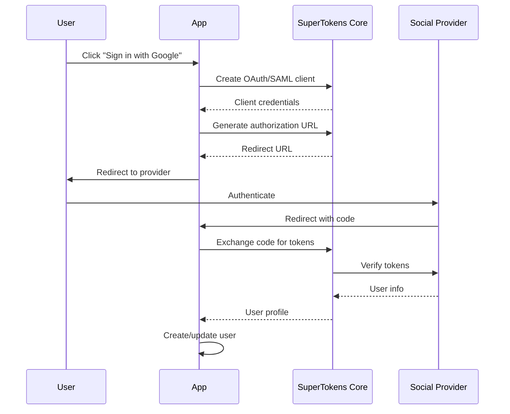

## Overview

Social login, also known as third-party authentication, allows users to sign in using their existing accounts from popular identity providers. SuperTokens Core doesn't implement social login directly but provides OAuth 2.0 and SAML capabilities that enable integration with social providers.

## Supported Methods

SuperTokens Core supports social login through two primary protocols:

### OAuth 2.0

Use the OAuth 2.0 implementation for modern social providers:

- Google
- Facebook  
- GitHub
- Apple
- LinkedIn
- Twitter/X
- Microsoft
- Discord
- And any OAuth 2.0 compliant provider

See [oauth.mdx](/auth/oauth) for detailed OAuth 2.0 documentation.

### SAML

Use SAML for enterprise identity providers:

- Azure AD
- Okta
- OneLogin
- Auth0
- Google Workspace
- ADFS
- And any SAML 2.0 compliant provider

See [saml.mdx](/auth/saml) for detailed SAML documentation.

## Architecture

Social login in SuperTokens follows a standard flow:



## Implementation Approaches

### 1. OAuth 2.0 Based Providers

For providers supporting OAuth 2.0 (Google, Facebook, GitHub, etc.):

**Step 1: Create OAuth Client**

```bash
POST /recipe/oauth/clients
```

```json
{
  "clientId": "google-client-id",
  "clientSecret": "google-client-secret",
  "isClientCredentialsOnly": false,
  "enableRefreshTokenRotation": true
}
```

**Step 2: Generate Authorization URL**

Construct the authorization URL manually or use the OAuth auth API:

```bash
GET /recipe/oauth/auth?client_id=google-client-id&redirect_uri=https://yourapp.com/callback&scope=openid email profile
```

**Step 3: Exchange Code for Tokens**

```bash
POST /recipe/oauth/token
```

```json
{
  "grant_type": "authorization_code",
  "code": "authorization-code",
  "redirect_uri": "https://yourapp.com/callback",
  "client_id": "google-client-id",
  "client_secret": "google-client-secret"
}
```

**Step 4: Get User Info**

Use the access token to fetch user information from the provider's userinfo endpoint.

### 2. SAML Based Providers

For enterprise providers supporting SAML (Azure AD, Okta, etc.):

**Step 1: Create SAML Client**

```bash
POST /recipe/saml/client
```

```json
{
  "clientId": "azure-client",
  "clientSecret": "secret",
  "metadataXML": "<EntityDescriptor>...</EntityDescriptor>",
  "defaultRedirectURI": "https://yourapp.com/callback",
  "redirectURIs": ["https://yourapp.com/callback"],
  "allowIDPInitiatedLogin": false,
  "enableRequestSigning": true
}
```

**Step 2: Generate SSO URL**

```bash
POST /recipe/saml/authorize
```

```json
{
  "clientId": "azure-client",
  "redirectURI": "https://yourapp.com/callback",
  "state": "random-state"
}
```

**Step 3: Handle Callback**

```bash
POST /recipe/saml/callback
```

**Step 4: Get User Info**

```bash
POST /recipe/saml/userinfo
```

## User Management

### Account Linking

Social login accounts can be linked with other authentication methods:

- Email/password accounts
- Passwordless accounts
- Other social accounts
- WebAuthn accounts

The core handles:
- Duplicate email detection
- Primary user account management
- Login method aggregation

### User Profile Mapping

Map social provider profiles to your user schema:

**Common Fields:**
- `sub` / `id`: Unique provider user ID
- `email`: User's email address
- `name`: Full name
- `given_name`: First name
- `family_name`: Last name
- `picture`: Profile picture URL
- `email_verified`: Email verification status

## Provider-Specific Configuration

### Google

**OAuth 2.0 Configuration:**
- Authorization URL: `https://accounts.google.com/o/oauth2/v2/auth`
- Token URL: `https://oauth2.googleapis.com/token`
- UserInfo URL: `https://www.googleapis.com/oauth2/v3/userinfo`
- Scopes: `openid email profile`

### Facebook

**OAuth 2.0 Configuration:**
- Authorization URL: `https://www.facebook.com/v12.0/dialog/oauth`
- Token URL: `https://graph.facebook.com/v12.0/oauth/access_token`
- UserInfo URL: `https://graph.facebook.com/me?fields=id,name,email,picture`
- Scopes: `email public_profile`

### GitHub

**OAuth 2.0 Configuration:**
- Authorization URL: `https://github.com/login/oauth/authorize`
- Token URL: `https://github.com/login/oauth/access_token`
- UserInfo URL: `https://api.github.com/user`
- Scopes: `user:email`

### Apple

**OAuth 2.0 Configuration:**
- Authorization URL: `https://appleid.apple.com/auth/authorize`
- Token URL: `https://appleid.apple.com/auth/token`
- Scopes: `name email`
- Special: Requires client secret JWT generation

### Azure AD (Microsoft)

**SAML or OAuth 2.0:**
- SAML: Use enterprise application in Azure AD
- OAuth: Use app registration in Azure AD
- Authorization URL: `https://login.microsoftonline.com/{tenant}/oauth2/v2.0/authorize`
- Token URL: `https://login.microsoftonline.com/{tenant}/oauth2/v2.0/token`

## Security Considerations

### State Parameter

Always use a state parameter to prevent CSRF attacks:

```javascript
const state = generateRandomString();
saveStateToSession(state);
redirect(authUrl + "&state=" + state);
```

Verify state on callback:

```javascript
const receivedState = getQueryParam("state");
const savedState = getStateFromSession();
if (receivedState !== savedState) {
  throw new Error("Invalid state");
}
```

### PKCE (Proof Key for Code Exchange)

For public clients (mobile/SPA), use PKCE:

1. Generate code verifier
2. Create code challenge (SHA-256 hash)
3. Send challenge with authorization request
4. Send verifier with token request

### Token Validation

Always validate tokens received from providers:

- Verify signature (for JWT tokens)
- Check issuer matches expected provider
- Validate audience matches your client ID
- Ensure token hasn't expired
- Verify nonce (if using OpenID Connect)

### Redirect URI Validation

Super Tokens Core validates redirect URIs:

- Must match exactly (no wildcards)
- Must use HTTPS in production
- Must be pre-registered with the client

## Email Verification

Handling email verification from social providers:

**Auto-verified emails:**
- Google: Emails are verified by default
- Facebook: Check `email_verified` claim
- GitHub: Emails marked as verified in GitHub
- Apple: Emails are verified by default

**Manual verification needed:**
- Some providers don't verify emails
- Mark email as unverified in your system
- Trigger email verification flow

## Error Handling

### Common OAuth Errors

- `invalid_client`: Client authentication failed
- `invalid_grant`: Authorization code is invalid or expired
- `invalid_request`: Missing or invalid parameters
- `unauthorized_client`: Client not authorized for this grant type
- `unsupported_grant_type`: Grant type not supported
- `access_denied`: User denied authorization

### Common SAML Errors

- `SAMLResponseVerificationFailed`: Signature verification failed
- `InvalidRelayState`: Relay state doesn't match
- `InvalidClient`: SAML client not found
- `IDPInitiatedLoginDisallowed`: IDP-initiated login not allowed

## Testing

### Test Credentials

Many providers offer test/sandbox environments:

- **Google**: Use OAuth playground
- **Facebook**: Use test users in app dashboard
- **GitHub**: Use development OAuth apps
- **Azure AD**: Use test tenant

### Local Testing

For local development:

1. Use ngrok or similar to expose localhost
2. Configure redirect URI to tunnel URL
3. Set up test credentials
4. Test full authentication flow

## Best Practices

1. **Always use HTTPS**: Required by most providers
2. **Store secrets securely**: Use environment variables or secret managers
3. **Implement state parameter**: Prevent CSRF attacks
4. **Handle errors gracefully**: Show user-friendly messages
5. **Cache user info**: Reduce API calls to providers
6. **Respect rate limits**: Implement backoff for provider APIs
7. **Keep libraries updated**: Security patches are important
8. **Support multiple providers**: Give users choice
9. **Account linking**: Allow users to link multiple providers
10. **Privacy considerations**: Only request necessary scopes

## Multi-Tenancy

Social login with multi-tenancy:

- Each tenant can have different provider configurations
- Users are isolated per tenant
- Provider clients are tenant-specific
- Account linking respects tenant boundaries

## Migration

Migrating users from other social login implementations:

1. Export user data from existing system
2. Map provider IDs to SuperTokens format
3. Import using bulk import APIs
4. Preserve email verification status
5. Link accounts as needed