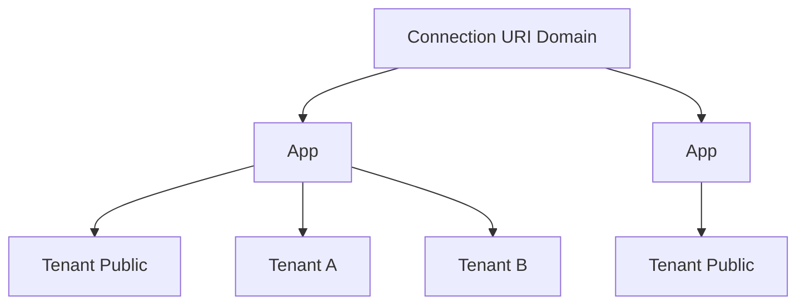

## Overview

SuperTokens Core provides enterprise-grade multi-tenancy support, allowing you to serve multiple customers (tenants) from a single SuperTokens instance. Each tenant can have isolated data, custom configurations, and independent authentication settings.

## Architecture

### Hierarchy

SuperTokens uses a three-level hierarchy:



<Steps>
  <Step title="Connection URI Domain">
    Top-level identifier, typically maps to a database connection
  </Step>
  <Step title="App">
    Application within a connection URI domain, shares a user pool
  </Step>
  <Step title="Tenant">
    Individual tenant within an app, can have custom configuration
  </Step>
</Steps>

### Tenant Identifier

Every operation is scoped to a `TenantIdentifier`:

```java
public class TenantIdentifier {
    private String connectionUriDomain;  // Default: ""
    private String appId;                // Default: "public"
    private String tenantId;             // Default: "public"
}
```

<Note>
  The default tenant is represented as `TenantIdentifier(null, null, null)` which resolves to `("", "public", "public")`.
</Note>

## Creating Tenants

### Tenant Configuration

From `/home/daytona/workspace/source/src/main/java/io/supertokens/multitenancy/Multitenancy.java:231-318`:

```java
public static boolean addNewOrUpdateAppOrTenant(
    Main main, 
    TenantConfig newTenant,
    boolean shouldPreventProtectedConfigUpdate,
    boolean skipThirdPartyConfigValidation,
    boolean forceReloadResources
) {
    // Validate tenant configuration
    validateTenantConfig(main, newTenant, 
        shouldPreventProtectedConfigUpdate, 
        skipThirdPartyConfigValidation);
    
    // Create in shared database
    StorageLayer.getMultitenancyStorage(main)
        .createTenant(newTenant);
    
    // Refresh tenant resources
    MultitenancyHelper.getInstance(main)
        .refreshTenantsInCoreBasedOnChangesInCoreConfigOrIfTenantListChanged(false);
    
    // Add tenant ID in target storage
    storage.addTenantIdInTargetStorage(newTenant.tenantIdentifier);
    
    return true;
}
```

### Tenant Config Structure

<ParamField path="tenantIdentifier" type="TenantIdentifier" required>
  Unique identifier for the tenant
</ParamField>

<ParamField path="coreConfig" type="JsonObject">
  Tenant-specific core configuration overrides
</ParamField>

<ParamField path="thirdPartyConfig" type="ThirdPartyConfig">
  OAuth/OIDC provider configurations for this tenant
</ParamField>

<ParamField path="emailPasswordConfig" type="EmailPasswordConfig">
  Email/password specific settings
</ParamField>

<ParamField path="passwordlessConfig" type="PasswordlessConfig">
  Passwordless authentication settings
</ParamField>

## Permission Model

From `/home/daytona/workspace/source/src/main/java/io/supertokens/multitenancy/Multitenancy.java:63-126`:

### Create/Update Permissions

<CardGroup cols={3}>
  <Card title="Tenant Level" icon="users">
    Use public tenant or same tenant
  </Card>
  <Card title="App Level" icon="layer-group">
    Use public tenant of the app
  </Card>
  <Card title="CUD Level" icon="database">
    Use base tenant or same CUD
  </Card>
</CardGroup>

```java
public static void checkPermissionsForCreateOrUpdate(
    Main main, 
    TenantIdentifier sourceTenant,
    TenantIdentifier targetTenant
) throws BadPermissionException {
    // Creating/updating a tenant
    if (!targetTenant.getTenantId().equals(DEFAULT_TENANT_ID)) {
        if (!sourceTenant.getTenantId().equals(DEFAULT_TENANT_ID)
                && !sourceTenant.getTenantId().equals(targetTenant.getTenantId())) {
            throw new BadPermissionException(
                "You must use the public or same tenant to add/update a tenant"
            );
        }
    }
    
    // Creating/updating an app
    if (!targetTenant.getAppId().equals(DEFAULT_APP_ID)) {
        if (!sourceTenant.getTenantId().equals(DEFAULT_TENANT_ID)
                || (!sourceTenant.getAppId().equals(DEFAULT_APP_ID) 
                    && !sourceTenant.getAppId().equals(targetTenant.getAppId()))) {
            throw new BadPermissionException(
                "You must use the public or same app to add/update an app"
            );
        }
    }
}
```

### Delete Permissions

<Warning>
  Only parent entities can delete children:
  - Parent app can delete tenants
  - Parent CUD can delete apps
  - Base tenant can delete connection URI domains
</Warning>

## User Management

### User-Tenant Association

Users can be associated with multiple tenants:

```java
public static boolean addUserIdToTenant(
    Main main,
    TenantIdentifier tenantIdentifier,
    Storage storage,
    String userId
) throws DuplicateEmailException, 
         DuplicatePhoneNumberException,
         DuplicateThirdPartyUserException {
    
    // Get user to associate
    AuthRecipeUserInfo user = authRecipeStorage
        .getPrimaryUserById_Transaction(appIdentifier, con, userId);
    
    // Check for conflicts in target tenant
    if (user.isPrimaryUser) {
        // Check email conflicts
        for (String email : user.emails) {
            AuthRecipeUserInfo[] usersWithSameEmail = 
                authRecipeStorage.listPrimaryUsersByEmail_Transaction(
                    appIdentifier, con, email
                );
            // Validate no conflicts exist
        }
        
        // Check phone conflicts
        // Check third-party conflicts
    }
    
    // Add user to tenant
    return storage.addUserIdToTenant_Transaction(
        tenantIdentifier, con, userId
    );
}
```

### Conflict Prevention

From `/home/daytona/workspace/source/src/main/java/io/supertokens/multitenancy/Multitenancy.java:396-555`:

When associating a **primary user** with a tenant, SuperTokens checks:

<Steps>
  <Step title="Email Uniqueness">
    No other primary user in the tenant has the same email for the same recipe
  </Step>
  
  <Step title="Phone Number Uniqueness">
    No other primary user in the tenant has the same phone number
  </Step>
  
  <Step title="Third-Party Uniqueness">
    No other primary user has the same third-party ID + third-party user ID
  </Step>
</Steps>

<Note>
  These checks only apply to **primary users**. Recipe users without account linking can have duplicate identifiers across tenants.
</Note>

### Disassociating Users

```java
public static boolean removeUserIdFromTenant(
    Main main,
    TenantIdentifier tenantIdentifier,
    Storage storage,
    String userId,
    String externalUserId
) throws UnknownUserIdException {
    // Delete non-auth recipe data (sessions, metadata, etc.)
    boolean didExist = AuthRecipe.deleteNonAuthRecipeUser(
        tenantIdentifier, storage, externalUserId ?? userId
    );
    
    // Remove from tenant
    didExist = storage.removeUserIdFromTenant(
        tenantIdentifier, userId
    ) || didExist;
    
    return didExist;
}
```

## Storage Architecture

### Database Isolation Models

SuperTokens supports multiple storage models:

<CardGroup cols={3}>
  <Card title="Shared Database" icon="database">
    All tenants in one database with tenant_id columns
  </Card>
  <Card title="Separate Databases" icon="server">
    Each tenant has its own isolated database
  </Card>
  <Card title="Hybrid" icon="layer-group">
    Mix of shared and isolated based on tier
  </Card>
</CardGroup>

### Tenant Storage Mapping

Tenants within the same app share a **user pool**:

```java
// All tenants in an app share the same user pool storage
String userPoolId = storage.getUserPoolId();

// Each tenant can override configuration
TenantConfig tenant = Multitenancy.getTenantInfo(main, tenantIdentifier);
JsonObject tenantConfig = tenant.coreConfig;
```

## Configuration

### Core Configuration Overrides

Tenants can override most core configurations:

```json
{
  "access_token_validity": 7200,
  "refresh_token_validity": 144000,
  "password_hashing_alg": "BCRYPT",
  "bcrypt_log_rounds": 11
}
```

<Warning>
  **Protected configs** cannot be changed after tenant creation:
  - Database connection parameters
  - Core service ports
  - Base paths
</Warning>

From `/home/daytona/workspace/source/src/main/java/io/supertokens/multitenancy/Multitenancy.java:158-180`:

```java
if (shouldPreventProtecterdConfigUpdate) {
    for (String protectedConfig : CoreConfig.PROTECTED_CONFIGS) {
        if (targetTenantConfig.coreConfig.has(protectedConfig) &&
                !targetTenantConfig.coreConfig.get(protectedConfig)
                    .equals(currentConfig.get(protectedConfig))) {
            throw new BadPermissionException(
                "Not allowed to modify protected configs."
            );
        }
    }
}
```

### Third-Party Provider Configuration

Each tenant can have independent OAuth/OIDC providers:

```java
public class ThirdPartyConfig {
    public ProviderConfig[] providers;
}

public class ProviderConfig {
    public String thirdPartyId;           // "google", "github", etc.
    public ClientConfig[] clients;
    public String authorizationEndpoint;
    public String tokenEndpoint;
    // ... other OIDC endpoints
}
```

## Listing Tenants

### All Tenants

```java
TenantConfig[] allTenants = Multitenancy.getAllTenants(main);
```

### Tenants for an App

```java
TenantConfig[] appTenants = Multitenancy.getAllTenantsForApp(
    appIdentifier, main
);
```

### Tenants for Connection URI Domain

```java
TenantConfig[] cudTenants = 
    Multitenancy.getAllAppsAndTenantsForConnectionUriDomain(
        connectionUriDomain, main
    );
```

## Deleting Tenants

### Delete a Tenant

From `/home/daytona/workspace/source/src/main/java/io/supertokens/multitenancy/Multitenancy.java:320-335`:

```java
public static boolean deleteTenant(
    TenantIdentifier tenantIdentifier,
    Main main
) throws CannotDeleteNullTenantException {
    if (tenantIdentifier.getTenantId().equals(DEFAULT_TENANT_ID)) {
        throw new CannotDeleteNullTenantException();
    }
    
    // Delete from tenant-specific storage
    storage.deleteTenantIdInTargetStorage(tenantIdentifier);
    
    // Delete from base storage
    boolean didExist = StorageLayer.getMultitenancyStorage(main)
        .deleteTenantInfoInBaseStorage(tenantIdentifier);
    
    // Refresh resources
    MultitenancyHelper.getInstance(main)
        .refreshTenantsInCoreBasedOnChangesInCoreConfigOrIfTenantListChanged(true);
    
    return didExist;
}
```

<Warning>
  Deleting a tenant does not delete user data. You must explicitly delete users before deleting the tenant.
</Warning>

### Delete an App

From `/home/daytona/workspace/source/src/main/java/io/supertokens/multitenancy/Multitenancy.java:337-357`:

```java
public static boolean deleteApp(
    AppIdentifier appIdentifier,
    Main main
) throws BadPermissionException {
    if (appIdentifier.getAppId().equals(DEFAULT_APP_ID)) {
        throw new CannotDeleteNullAppIdException();
    }
    
    // Must delete all tenants except public first
    if (getAllTenantsForApp(appIdentifier, main).length > 1) {
        throw new BadPermissionException(
            "Please delete all tenants except the public tenant first"
        );
    }
    
    // Delete app
    return deleteAppImplementation(appIdentifier, main);
}
```

## API Domain Configuration

Store per-app website and API domains:

```java
Multitenancy.saveWebsiteAndAPIDomainForApp(
    storage, appIdentifier, 
    "https://example.com",      // websiteDomain
    "https://api.example.com"   // apiDomain
);

// Retrieve domains
String websiteDomain = Multitenancy.getWebsiteDomain(storage, appIdentifier);
String apiDomain = Multitenancy.getAPIDomain(storage, appIdentifier);
```

## Feature Flag Requirement

<Warning>
  Multi-tenancy requires the `MULTI_TENANCY` feature flag to be enabled:
  
  ```java
  if (Arrays.stream(FeatureFlag.getInstance(main, appIdentifier)
          .getEnabledFeatures())
      .noneMatch(feature -> feature == EE_FEATURES.MULTI_TENANCY)) {
      throw new FeatureNotEnabledException(EE_FEATURES.MULTI_TENANCY);
  }
  ```
</Warning>

## Use Cases

<CardGroup cols={2}>
  <Card title="B2B SaaS" icon="building">
    Each customer gets their own tenant with isolated data and branding
  </Card>
  <Card title="White-Label Apps" icon="palette">
    Different apps for different brands using the same codebase
  </Card>
  <Card title="Regional Isolation" icon="globe">
    Separate tenants for different geographic regions
  </Card>
  <Card title="Development Environments" icon="flask">
    Separate tenants for dev, staging, and production
  </Card>
</CardGroup>

## Best Practices

1. **Use Meaningful IDs**: Choose descriptive tenant IDs like `customer-acme` instead of UUIDs
2. **Plan User Pool Boundaries**: Users within an app share a pool - plan accordingly
3. **Minimize Config Overrides**: Only override what's necessary per tenant
4. **Handle Tenant Not Found**: Always catch `TenantOrAppNotFoundException` gracefully
5. **Use Public Tenant for Global Operations**: Store app-wide settings in the public tenant

## Related Topics

- [User Management](/concepts/user-management)
- [Security Features](/concepts/security)
- [Bulk Import](/advanced/bulk-import)