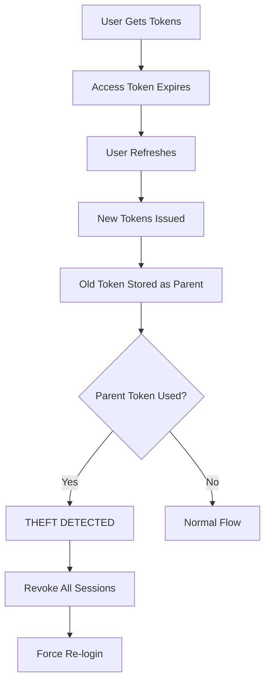

## Overview

SuperTokens Core implements multiple layers of security including industry-standard password hashing, JWT signing with key rotation, token encryption, and protection against common attacks.

## Password Security

### Password Hashing Algorithms

SuperTokens supports multiple password hashing algorithms:

<CardGroup cols={3}>
  <Card title="Argon2" icon="shield-halved">
    Memory-hard algorithm, best security (default)
  </Card>
  <Card title="BCrypt" icon="lock">
    Industry standard, configurable work factor
  </Card>
  <Card title="Firebase SCrypt" icon="fire">
    For Firebase migrations
  </Card>
</CardGroup>

### Argon2 Configuration

From [io/supertokens/emailpassword/PasswordHashing.java](https://github.com/supertokens/supertokens-core/blob/master/src/main/java/io/supertokens/emailpassword/PasswordHashing.java):

<ParamField path="argon2_iterations" type="number" default="1">
  Number of iterations (time cost)
</ParamField>

<ParamField path="argon2_memory_kb" type="number" default="87795">
  Memory usage in KB (~85 MB)
</ParamField>

<ParamField path="argon2_parallelism" type="number" default="2">
  Number of parallel threads
</ParamField>

<ParamField path="argon2_hashing_pool_size" type="number" default="1">
  Thread pool size for hashing operations
</ParamField>

```java
// Argon2 hashing
String passwordHash = PasswordHashing.getInstance(main)
    .createHashWithSalt(
        appIdentifier,
        plainTextPassword
    );

// Verification
boolean isValid = PasswordHashing.getInstance(main)
    .verifyPasswordWithHash(
        appIdentifier,
        plainTextPassword,
        passwordHash
    );
```

### BCrypt Configuration

<ParamField path="bcrypt_log_rounds" type="number" default="11">
  Work factor (2^11 = 2048 rounds)
</ParamField>

<Note>
  Higher log rounds increase security but slow down authentication. 11 rounds takes approximately 100-200ms.
</Note>

### Firebase SCrypt

For migrating from Firebase:

<ParamField path="firebase_password_hashing_signer_key" type="string">
  Base64-encoded signer key from Firebase
</ParamField>

<ParamField path="firebase_password_hashing_salt_separator" type="string">
  Base64-encoded salt separator
</ParamField>

<ParamField path="firebase_password_hashing_rounds" type="number" default="8">
  Number of rounds used in Firebase
</ParamField>

<ParamField path="firebase_password_hashing_mem_cost" type="number" default="14">
  Memory cost parameter
</ParamField>

## Token Signing

### JWT Signing Keys

SuperTokens uses **RS256** (RSA with SHA-256) for signing JWTs:

```java
public class JWTSigningKeyInfo {
    public String keyId;           // Unique key identifier
    public String keyString;       // RSA private key (PEM)
    public String publicKey;       // RSA public key (PEM)
    public long createdAtTime;
    public String algorithm;       // "RS256"
}
```

### Key Types

<CardGroup cols={2}>
  <Card title="Dynamic Keys" icon="rotate">
    Rotate automatically, used for access tokens by default
  </Card>
  <Card title="Static Keys" icon="lock">
    Never rotate, used for custom JWTs and special cases
  </Card>
</CardGroup>

### Key Rotation

From [io/supertokens/signingkeys/SigningKeys.java](https://github.com/supertokens/supertokens-core/blob/master/src/main/java/io/supertokens/signingkeys/SigningKeys.java):

<Steps>
  <Step title="Generate New Key">
    Create new RSA key pair every `access_token_signing_key_update_interval` hours
  </Step>
  
  <Step title="Transition Period">
    Old keys remain valid for token verification during their lifetime
  </Step>
  
  <Step title="Clean Up">
    Remove expired keys from storage
  </Step>
</Steps>

<ParamField path="access_token_signing_key_update_interval" type="number" default="168">
  Hours between key rotations (default: 7 days)
</ParamField>

<ParamField path="access_token_dynamic_signing_key_update_interval" type="number" default="168">
  Hours between dynamic key rotations
</ParamField>

### JWT Creation

From [io/supertokens/jwt/JWTSigningFunctions.java:84-147](https://github.com/supertokens/supertokens-core/blob/master/src/main/java/io/supertokens/jwt/JWTSigningFunctions.java#L84-L147):

```java
public static String createJWTToken(
    AppIdentifier appIdentifier,
    Main main,
    String algorithm,              // "RS256"
    JsonObject payload,
    String jwksDomain,             // Issuer
    long jwtValidityInSeconds,
    boolean useDynamicKey
) {
    // Get signing key
    JWTSigningKeyInfo keyToUse;
    if (useDynamicKey) {
        keyToUse = SigningKeys.getInstance(appIdentifier, main)
            .getLatestIssuedDynamicKey();
    } else {
        keyToUse = SigningKeys.getInstance(appIdentifier, main)
            .getStaticKeyForAlgorithm(SupportedAlgorithms.RS256);
    }
    
    // Create JWT with headers
    Map<String, Object> headerClaims = new HashMap<>();
    headerClaims.put("alg", "RS256");
    headerClaims.put("typ", "JWT");
    headerClaims.put("kid", keyToUse.keyId);
    
    // Add standard claims
    long issued = System.currentTimeMillis();
    long expires = issued + (jwtValidityInSeconds * 1000);
    
    if (jwksDomain != null) {
        payload.addProperty("iss", jwksDomain);
    }
    
    // Sign and return
    return JWTCreator.create()
        .withKeyId(keyToUse.keyId)
        .withHeader(headerClaims)
        .withIssuedAt(new Date(issued))
        .withExpiresAt(new Date(expires))
        .withPayload(payload.toString())
        .sign(algorithm);
}
```

### JWKS Endpoint

Public keys are exposed via JWKS endpoint:

```json
{
  "keys": [
    {
      "kty": "RSA",
      "kid": "s-2de612a5-a5ba-413e-9216-4c43e2e78c86",
      "n": "...",
      "e": "AQAB",
      "alg": "RS256",
      "use": "sig"
    }
  ]
}
```

## Token Encryption

### Refresh Token Encryption

Refresh tokens are encrypted using AES-256-CBC:

```java
public static TokenInfo createNewRefreshToken(
    TenantIdentifier tenantIdentifier,
    Main main,
    String sessionHandle,
    String userId,
    String parentRefreshTokenHash,
    String antiCsrfToken
) {
    // Get encryption key
    String key = RefreshTokenKey.getInstance(appIdentifier, main).getKey();
    
    // Create nonce
    String nonce = Utils.hashSHA256(UUID.randomUUID().toString());
    
    // Create payload
    RefreshTokenPayload payload = new RefreshTokenPayload(
        sessionHandle, userId, parentRefreshTokenHash, 
        nonce, antiCsrfToken, tenantId
    );
    
    // Encrypt payload
    String payloadSerialised = new Gson().toJson(payload);
    String encryptedPayload = Utils.encrypt(payloadSerialised, key);
    
    // Format: <encrypted>.<nonce>.V2
    String token = encryptedPayload + "." + nonce + ".V2";
    
    return new TokenInfo(token, expiryTime, createdTime);
}
```

### Encryption Key Storage

Refresh token encryption keys are stored securely in the database and cached in memory.

<Warning>
  Never log or expose refresh tokens. They contain encrypted user session data.
</Warning>

## Attack Prevention

### Token Theft Detection

SuperTokens detects token theft through **refresh token rotation**:



From [io/supertokens/session/Session.java:652-654](https://github.com/supertokens/supertokens-core/blob/master/src/main/java/io/supertokens/session/Session.java#L652-L654):

```java
if (parentTokenUsed) {
    throw new TokenTheftDetectedException(
        sessionHandle, 
        recipeUserId, 
        primaryUserId
    );
}
```

### Anti-CSRF Protection

<ParamField path="enable_anti_csrf" type="boolean" default="true">
  Enable anti-CSRF token validation
</ParamField>

Anti-CSRF tokens:
- Generated as random UUIDs
- Stored in both access and refresh tokens
- Validated on session verification and refresh
- Sent as separate header or cookie

```java
// Generate CSRF token
String antiCsrfToken = enableAntiCsrf 
    ? UUID.randomUUID().toString() 
    : null;

// Verify CSRF token
if (enableAntiCsrf && doAntiCsrfCheck) {
    if (antiCsrfToken == null || 
        !antiCsrfToken.equals(accessToken.antiCsrfToken)) {
        throw new TryRefreshTokenException("anti-csrf check failed");
    }
}
```

### Session Blacklisting

Optional database verification to detect revoked sessions:

```java
if (checkDatabase) {
    SessionInfo sessionInfo = storage.getSession(
        tenantIdentifier, 
        accessToken.sessionHandle
    );
    
    if (sessionInfo == null) {
        throw new UnauthorisedException(
            "Session has ended or has been blacklisted"
        );
    }
}
```

<Note>
  Database checks add latency but provide immediate session invalidation. Without them, revoked sessions remain valid until access token expiry.
</Note>

### Rate Limiting

<ParamField path="max_server_pool_size" type="number" default="10">
  Maximum concurrent requests per core instance
</ParamField>

Built-in connection pooling prevents resource exhaustion.

## Secure Storage

### Password Reset Tokens

Password reset tokens are:
- Randomly generated UUIDs
- Hashed before storage using SHA-256
- Single-use only
- Time-limited (configurable expiry)

<ParamField path="password_reset_token_lifetime" type="number" default="3600000">
  Reset token lifetime in milliseconds (default: 1 hour)
</ParamField>

### Email Verification Tokens

Similar to password reset tokens:
- UUID-based
- Hashed in database
- Single-use
- Time-limited

<ParamField path="email_verification_token_lifetime" type="number" default="86400000">
  Verification token lifetime in milliseconds (default: 24 hours)
</ParamField>

## Cryptographic Operations

### Hashing Utilities

From [io/supertokens/utils/Utils.java](https://github.com/supertokens/supertokens-core/blob/master/src/main/java/io/supertokens/utils/Utils.java):

```java
// SHA-256 hashing
public static String hashSHA256(String input) {
    MessageDigest digest = MessageDigest.getInstance("SHA-256");
    byte[] hash = digest.digest(input.getBytes(StandardCharsets.UTF_8));
    return bytesToHex(hash);
}

// Double hashing for refresh tokens
String doubleHash = Utils.hashSHA256(
    Utils.hashSHA256(refreshToken)
);
```

### AES Encryption/Decryption

```java
// Encrypt data
public static String encrypt(String data, String key) 
    throws Exception {
    Cipher cipher = Cipher.getInstance("AES/CBC/PKCS5Padding");
    SecretKeySpec secretKey = new SecretKeySpec(
        key.getBytes(), "AES"
    );
    cipher.init(Cipher.ENCRYPT_MODE, secretKey);
    byte[] encrypted = cipher.doFinal(data.getBytes());
    return Base64.getEncoder().encodeToString(encrypted);
}

// Decrypt data
public static String decrypt(String encryptedData, String key) 
    throws Exception {
    Cipher cipher = Cipher.getInstance("AES/CBC/PKCS5Padding");
    SecretKeySpec secretKey = new SecretKeySpec(
        key.getBytes(), "AES"
    );
    cipher.init(Cipher.DECRYPT_MODE, secretKey);
    byte[] decoded = Base64.getDecoder().decode(encryptedData);
    byte[] decrypted = cipher.doFinal(decoded);
    return new String(decrypted);
}
```

## Database Security

### SQL Injection Prevention

All database queries use **parameterized statements**:

```java
// Safe - parameterized query
PreparedStatement pst = con.prepareStatement(
    "SELECT * FROM users WHERE email = ?"
);
pst.setString(1, email);

// NEVER do this:
// String query = "SELECT * FROM users WHERE email = '" + email + "'";
```

### Connection Pooling

<ParamField path="postgresql_connection_pool_size" type="number" default="10">
  PostgreSQL connection pool size
</ParamField>

<ParamField path="mysql_connection_pool_size" type="number" default="10">
  MySQL connection pool size
</ParamField>

Connection pooling prevents:
- Connection exhaustion attacks
- Resource leaks
- Performance degradation

## Configuration Security

### Protected Configurations

From [io/supertokens/multitenancy/Multitenancy.java:174-179](https://github.com/supertokens/supertokens-core/blob/master/src/main/java/io/supertokens/multitenancy/Multitenancy.java#L174-L179):

These configs **cannot be changed** after tenant creation:

- Database connection parameters
- Core service ports
- Base paths
- API keys
- Signing keys

```java
for (String protectedConfig : CoreConfig.PROTECTED_CONFIGS) {
    if (tenantConfig.coreConfig.has(protectedConfig) &&
            !tenantConfig.coreConfig.get(protectedConfig)
                .equals(currentConfig.get(protectedConfig))) {
        throw new BadPermissionException(
            "Not allowed to modify protected configs."
        );
    }
}
```

### API Key Security

<ParamField path="api_keys" type="string">
  Comma-separated list of API keys for core authentication
</ParamField>

```yaml
api_keys: "key1,key2,key3"
```

API keys must be:
- At least 20 characters
- Randomly generated
- Stored securely (environment variables, secrets manager)
- Rotated periodically

<Warning>
  Never commit API keys to version control. Use environment variables or secret management systems.
</Warning>

## Security Headers

SuperTokens sets secure HTTP headers:

```
X-Content-Type-Options: nosniff
X-Frame-Options: DENY
X-XSS-Protection: 1; mode=block
Strict-Transport-Security: max-age=31536000; includeSubDomains
```

## CORS Configuration

<ParamField path="supertokens_saas_allowed_domains" type="string">
  Comma-separated list of allowed domains for CORS
</ParamField>

```yaml
supertokens_saas_allowed_domains: "https://example.com,https://app.example.com"
```

## Audit Logging

Enable detailed logging for security audits:

<ParamField path="log_level" type="string" default="INFO">
  Logging level: DEBUG, INFO, WARN, ERROR
</ParamField>

<ParamField path="info_log_path" type="string">
  Path to info log file
</ParamField>

<ParamField path="error_log_path" type="string">
  Path to error log file
</ParamField>

## Best Practices

<CardGroup cols={2}>
  <Card title="Use Argon2" icon="shield">
    Default password hashing algorithm provides best security
  </Card>
  <Card title="Enable Key Rotation" icon="rotate">
    Use dynamic keys with regular rotation intervals
  </Card>
  <Card title="Enable Anti-CSRF" icon="shield-check">
    Always enable for web applications
  </Card>
  <Card title="Monitor for Theft" icon="eye">
    Log TokenTheftDetectedException events
  </Card>
  <Card title="Use HTTPS Only" icon="lock">
    Never transmit tokens over unencrypted connections
  </Card>
  <Card title="Rotate API Keys" icon="key">
    Periodically update API keys and remove old ones
  </Card>
</CardGroup>

## Security Checklist

<Steps>
  <Step title="Configure Password Hashing">
    Set appropriate Argon2 or BCrypt parameters for your use case
  </Step>
  
  <Step title="Set Token Lifetimes">
    Balance security and user experience with token validity periods
  </Step>
  
  <Step title="Enable HTTPS">
    Ensure all communication uses TLS 1.2 or higher
  </Step>
  
  <Step title="Configure CORS">
    Whitelist only trusted domains
  </Step>
  
  <Step title="Set API Keys">
    Use strong, random API keys and rotate them regularly
  </Step>
  
  <Step title="Enable Logging">
    Configure audit logging for security events
  </Step>
  
  <Step title="Review Permissions">
    Follow principle of least privilege for tenant operations
  </Step>
</Steps>

## Related Topics

- [Session Management](/concepts/sessions)
- [JWT Signing](/advanced/jwt)
- [Multi-Tenancy](/concepts/multitenancy)