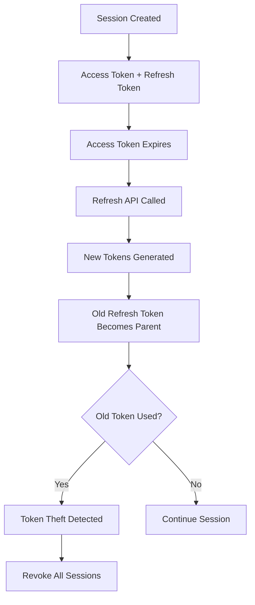

## Overview

SuperTokens Core implements a secure session management system with automatic token rotation, blacklisting support, and anti-CSRF protection. Sessions use JWT-based access tokens and encrypted refresh tokens.

## Session Architecture

### Token Types

SuperTokens uses three types of tokens:

<CardGroup cols={3}>
  <Card title="Access Token" icon="key">
    Short-lived JWT containing session data and user information
  </Card>
  <Card title="Refresh Token" icon="rotate">
    Long-lived encrypted token used to generate new access tokens
  </Card>
  <Card title="ID Refresh Token" icon="id-card">
    Client-side indicator for refresh token validity
  </Card>
</CardGroup>

### Access Token Structure

Access tokens are JWTs signed with RS256 containing:

```json
{
  "sessionHandle": "unique-session-id",
  "sub": "primary-user-id",
  "rsub": "recipe-user-id",
  "refreshTokenHash1": "hash-of-refresh-token",
  "parentRefreshTokenHash1": "hash-of-parent-token",
  "antiCsrfToken": "csrf-token",
  "tId": "tenant-id",
  "exp": 1234567890,
  "iat": 1234567890
}
```

<Note>
  Access tokens support multiple versions (V1-V5) for backwards compatibility. Version 5 includes both primary user ID (`sub`) and recipe user ID (`rsub`) for account linking.
</Note>

### Refresh Token Format

Refresh tokens are encrypted and contain:

- Session handle
- User ID
- Parent refresh token hash (for rotation)
- Anti-CSRF token
- Nonce for encryption
- Tenant ID

Format: `<encrypted-payload>.<nonce>.V2`

## Creating Sessions

Sessions are created with:

<Steps>
  <Step title="Generate Session Handle">
    Create a unique UUID for the session, appending tenant ID if not default:
    ```java
    String sessionHandle = UUID.randomUUID().toString();
    if (!tenantId.equals(DEFAULT_TENANT_ID)) {
        sessionHandle += "_" + tenantId;
    }
    ```
  </Step>
  
  <Step title="Create Tokens">
    Generate refresh token, then create access token with refresh token hash:
    ```java
    TokenInfo refreshToken = RefreshToken.createNewRefreshToken(
        tenantIdentifier, main, sessionHandle, userId, 
        parentRefreshTokenHash, antiCsrfToken
    );
    
    TokenInfo accessToken = AccessToken.createNewAccessToken(
        tenantIdentifier, main, sessionHandle, userId, primaryUserId,
        Utils.hashSHA256(refreshToken.token), null, userDataInJWT, 
        antiCsrfToken, null, version, useStaticKey
    );
    ```
  </Step>
  
  <Step title="Store Session in Database">
    Persist session with double-hashed refresh token:
    ```java
    storage.createNewSession(
        tenantIdentifier, sessionHandle, userId,
        Utils.hashSHA256(Utils.hashSHA256(refreshToken.token)),
        userDataInDatabase, refreshToken.expiry, 
        userDataInJWT, refreshToken.createdTime, useStaticKey
    );
    ```
  </Step>
</Steps>

## Token Rotation

### How Token Rotation Works

SuperTokens implements **automatic token rotation** to detect token theft:



<Warning>
  When a refresh token is used, its hash becomes the "parent" hash. If the parent token is used again, it indicates token theft, and all sessions for that user are revoked.
</Warning>

### Refresh Process

From [Session.java:543-650](https://github.com/supertokens/supertokens-core/blob/master/src/main/java/io/supertokens/session/Session.java#L543-L650):

1. **Verify refresh token** and extract session handle
2. **Check anti-CSRF token** if enabled
3. **Database transaction**:
   - Get session info from database
   - Check if `refreshTokenHash2` matches double-hashed input token
   - If match: Create new tokens with current token as parent
   - If parent hash matches: Promote child token (update database)
   - Otherwise: Token theft detected → throw exception

## Verifying Sessions

### Access Token Verification

The verification process:

<Steps>
  <Step title="JWT Signature Verification">
    Verify JWT signature using public keys from signing key rotation
  </Step>
  
  <Step title="Check Expiry">
    Validate token hasn't expired
  </Step>
  
  <Step title="Anti-CSRF Check">
    Compare anti-CSRF token from header with token in JWT
  </Step>
  
  <Step title="Database Check (Optional)">
    Verify session hasn't been blacklisted or revoked
  </Step>
  
  <Step title="Token Promotion">
    If `parentRefreshTokenHash1` exists, promote to current token
  </Step>
</Steps>

### Key Verification Code

From [AccessToken.java:62-169](https://github.com/supertokens/supertokens-core/blob/master/src/main/java/io/supertokens/session/accessToken/AccessToken.java#L62-L169):

```java
private static AccessTokenInfo getInfoFromAccessToken(
    AppIdentifier appIdentifier, Main main, String token, 
    boolean retry, boolean doAntiCsrfCheck
) {
    // Get all signing keys
    List<JWTSigningKeyInfo> keyInfoList = 
        SigningKeys.getInstance(appIdentifier, main).getAllKeys();
    
    // Pre-parse to get version and kid
    JWT.JWTPreParseInfo preParseJWTInfo = JWT.preParseJWTInfo(token);
    
    // Get specific key by kid
    JWTSigningKeyInfo keyInfo = 
        SigningKeys.getInstance(appIdentifier, main)
            .getSigningKeyById(preParseJWTInfo.kid);
    
    // Verify JWT
    JWT.JWTInfo jwtInfo = JWT.verifyJWTAndGetPayload(
        preParseJWTInfo, keyInfo.publicKey
    );
    
    // Check expiry and anti-CSRF
    if (tokenInfo.expiryTime < System.currentTimeMillis()) {
        throw new TryRefreshTokenException("Access token expired");
    }
    
    return tokenInfo;
}
```

## Session Revocation

### Revoke by Session Handle

```java
String[] revokedHandles = Session.revokeSessionUsingSessionHandles(
    main, appIdentifier, storage, new String[]{sessionHandle}
);
```

### Revoke All User Sessions

```java
String[] revokedHandles = Session.revokeAllSessionsForUser(
    main, appIdentifier, storage, userId
);
```

### Session Deletion Process

From [Session.java:819-857](https://github.com/supertokens/supertokens-core/blob/master/src/main/java/io/supertokens/session/Session.java#L819-L857):

<Steps>
  <Step title="Parse Tenant ID">
    Extract tenant ID from session handle (format: `uuid_tenantId`)
  </Step>
  
  <Step title="Group by Tenant">
    Organize session handles by their tenants
  </Step>
  
  <Step title="Delete from Storage">
    Remove sessions from database for each tenant
  </Step>
  
  <Step title="Return Revoked Sessions">
    Return list of successfully revoked session handles
  </Step>
</Steps>

## Security Features

### Anti-CSRF Protection

<ParamField path="enableAntiCsrf" type="boolean" default="true">
  When enabled, generates a random CSRF token stored in both access and refresh tokens
</ParamField>

```java
String antiCsrfToken = enableAntiCsrf ? UUID.randomUUID().toString() : null;
```

The anti-CSRF token is validated on:
- Session verification (if `doAntiCsrfCheck` is true)
- Session refresh

### Token Theft Detection

SuperTokens detects token theft when:

1. A **parent refresh token** is reused after its child was already used
2. The system throws `TokenTheftDetectedException`
3. **All sessions** for that user are automatically revoked

From [Session.java:652-654](https://github.com/supertokens/supertokens-core/blob/master/src/main/java/io/supertokens/session/Session.java#L652-L654):

```java
throw new TokenTheftDetectedException(
    sessionHandle, recipeUserId, primaryUserId
);
```

### Session Blacklisting

Optional database check during verification:

```java
if (checkDatabase) {
    SessionInfo info = storage.getSession(
        tenantIdentifier, sessionHandle
    );
    if (info == null) {
        throw new UnauthorisedException(
            "Session has ended or been blacklisted"
        );
    }
}
```

## Session Data Management

### JWT Payload (Client-Accessible)

Stored in access token, available on client:

```java
JsonObject userDataInJWT = new JsonObject();
userDataInJWT.addProperty("role", "admin");
userDataInJWT.addProperty("plan", "premium");
```

<Warning>
  JWT data is visible to the client. Never store sensitive information in the JWT payload.
</Warning>

### Database Session Data (Server-Only)

Stored in database, never sent to client:

```java
JsonObject userDataInDatabase = new JsonObject();
userDataInDatabase.addProperty("internalId", "secret-id");
```

### Updating Session Data

```java
SessionInformationHolder session = Session.regenerateToken(
    appIdentifier, main, accessToken, newJWTPayload
);
```

## Configuration

<ParamField path="access_token_validity" type="number" default="3600">
  Access token lifetime in seconds (default: 1 hour)
</ParamField>

<ParamField path="refresh_token_validity" type="number" default="144000">
  Refresh token lifetime in minutes (default: 100 days)
</ParamField>

<ParamField path="access_token_signing_key_update_interval" type="number" default="168">
  Hours between signing key rotations (default: 7 days)
</ParamField>

## Multi-Tenancy Support

Sessions are tenant-aware:

- Session handles include tenant ID: `{uuid}_{tenantId}`
- Access tokens contain `tId` claim
- Refresh tokens store tenant ID in encrypted payload
- Session operations are scoped to tenant storage

From [Session.java:141-144](https://github.com/supertokens/supertokens-core/blob/master/src/main/java/io/supertokens/session/Session.java#L141-L144):

```java
String sessionHandle = UUID.randomUUID().toString();
if (!tenantId.equals(TenantIdentifier.DEFAULT_TENANT_ID)) {
    sessionHandle += "_" + tenantId;
}
```

## Best Practices

<CardGroup cols={2}>
  <Card title="Always Use HTTPS" icon="lock">
    Never transmit tokens over insecure connections
  </Card>
  <Card title="Enable Anti-CSRF" icon="shield">
    Protect against cross-site attacks for web applications
  </Card>
  <Card title="Use Static Keys Sparingly" icon="key">
    Dynamic keys provide better security through rotation
  </Card>
  <Card title="Monitor Token Theft" icon="eye">
    Log and alert on TokenTheftDetectedException events
  </Card>
</CardGroup>

## Related Topics

- [JWT Signing & JWKS](/advanced/jwt)
- [Security Features](/concepts/security)
- [Multi-Tenancy](/concepts/multitenancy)